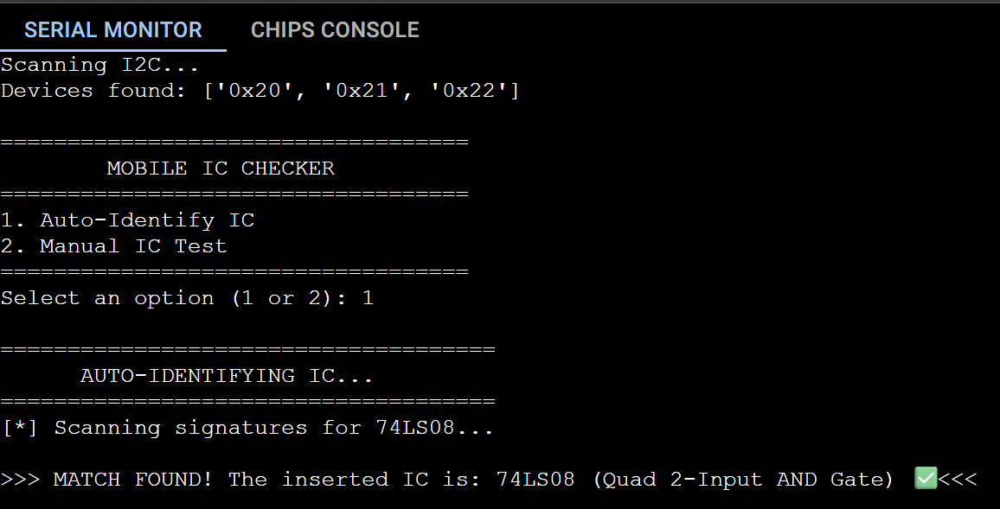
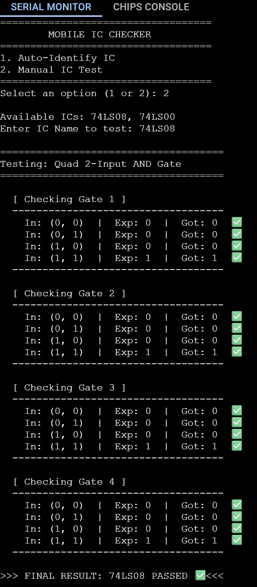

# Web-Based Universal IC Tester

A full-stack, Web-Based Universal IC Tester built with a Raspberry Pi Pico and MCP23017 I/O expanders. It reimagines the classic, expensive digital IC tester as a modern, scalable hardware and software system featuring dynamic pin routing, truth-table verification, and a Web Serial API frontend.

---

## Part 1: Hardware Implementation

### The Architecture: Brain vs. Muscle
This project splits the workload between a web browser and a microcontroller to overcome the storage and UI limitations of traditional embedded systems:
* **The Brain (Web Frontend):** A browser-based interface built with HTML/JS. It holds the infinitely expandable IC JSON database (truth tables, power pinouts) and handles the user interface.
* **The Muscle (Raspberry Pi Pico):** A "dumb" executor running MicroPython. It listens for JSON commands via USB serial, executes the raw I2C byte operations to the MCP23017 chips, and returns the physical logic results.

### Key Features
* **Universal Programmable Switching Matrix:** There is no fixed wiring for VCC or GND. The firmware dynamically configures any of the 40 ZIF socket pins as a Logic High, Logic Low, High-Z Input, or Power Supply based on the selected chip's footprint.
* **Web Serial API Integration:** Communicates directly with the Pico via USB serial directly from Google Chrome or Microsoft Edge. No standalone desktop apps or drivers required.
* **Truth Table Verification:** Injects test vectors (stimulus) into the IC and compares the physical logic responses against expected states.
* **Auto-Identify Mode:** Features a brute-force logic scanner that safely queries unknown chips against the database to automatically identify the component inserted into the socket.

### Hardware Requirements
* 1x Raspberry Pi Pico (MicroPython installed)
* 3x MCP23017 I2C I/O Expanders
* 1x 40-pin ZIF Socket (Zero Insertion Force)
* 1x Bi-Directional Logic Level Shifter (for 3.3V to 5V I2C safety)
* Digital Logic ICs for testing (e.g., 74LS00, 74LS08)
* Breadboard and Jumper Wires

### Pin Mapping & Wiring
The ZIF socket is bottom-justified and mapped across the three MCP23017 chips to support ICs ranging from 14-pin to 40-pin footprints. 

* **Top Chip (0x20):** Global Pins 0 - 15
* **Middle Chip (0x21):** Global Pins 16 - 31
* **Bottom Chip (0x22):** Global Pins 32 - 47
*(Example: A 14-pin IC placed at the bottom of the socket utilizes the GPA and GPB ports of the 0x22 chip).*

### Theory of Operation
1. **Safe Configuration:** All pins default to High-Impedance inputs to prevent shorts when an IC is inserted.
2. **Power Up:** The web frontend sends the IC's power footprint. The Pico drives the specific VCC pin HIGH and GND pin LOW.
3. **Vector Testing:** The Pico iterates through every possible input combination defined in the truth table, measuring the output pin.
4. **Conclusion:** If the physical logic matches the database exactly, a `PASS` signal is sent to the frontend UI. The IC is then safely powered down.

---

## Part 2: Software & Simulation Implementation

Before hardware assembly, the entire testing matrix was modeled and validated using the **Wokwi Simulator**. This allowed for safe testing of I2C communications, memory mapping, and logic validation without risking damage to physical components.

### Simulation Architecture
The simulation relies on a custom environment to accurately mimic the physical hardware:
* **MicroPython (`main.py`):** Handles the I2C scanning, pin mapping, and truth-table execution logic.
* **Custom C-API Chips:** Since Wokwi does not natively support all components, custom `chip.c` and `chip.json` files were written to emulate the exact behavior of the **MCP23017** I/O expanders and the bi-directional **Level Shifter**.

### Circuit Evolution & Routing
The simulation wiring underwent several iterations to ensure electrical accuracy and proper I2C addressing:

1. **Initial Prototyping:** The base circuit established the connections between the Pico, the three MCP23017 chips, and a target 74LS08 IC.
2. **Level Shifting Integration:** A custom level-shifter breakout was introduced to bridge the 3.3V Pico logic with the 5V MCP logic. 
3. **Final Circuit Diagram:** The hardware address pins (A0, A1, A2) on the MCP23017 chips were strictly routed to GND and VBUS. This ensures the Pico can distinctly recognize them at I2C addresses `0x20`, `0x21`, and `0x22`.

### Testing & Validation Outputs
The MicroPython serial monitor successfully validates the core capabilities of the IC Tester:

**1. I2C Scanning & Auto-Identification:**
Upon boot, the system successfully scans the bus and detects the three expanders. When set to Auto-Identify Mode, the script rapidly pulses test vectors against an unknown inserted chip, successfully matching the physical responses to the `74LS08` database signature.

**2. Manual IC Testing (Pass Condition):**
When manually commanding the tester to check a 74LS08 AND Gate, the system steps through all 4 gates. The console prints the expected (`Exp`) vs. actual (`Got`) states for every truth-table row, resulting in a perfect `PASS`.

**3. Fault Detection (Fail Condition):**
To prove the system catches bad logic, a 74LS08 chip was left in the socket, but the system was told to test it as a 74LS00 NAND Gate. The system correctly identifies the logic mismatch on every gate, throwing red `X` marks and halting with a final `FAILED` status.

